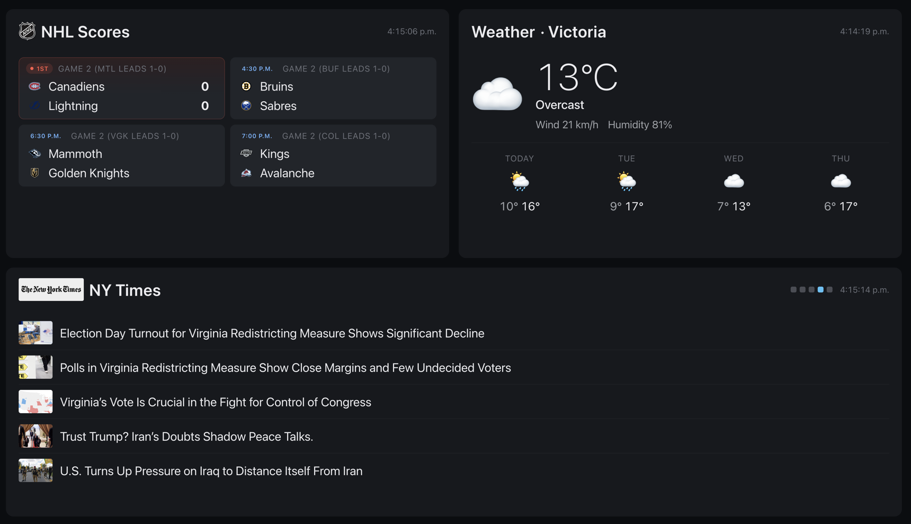
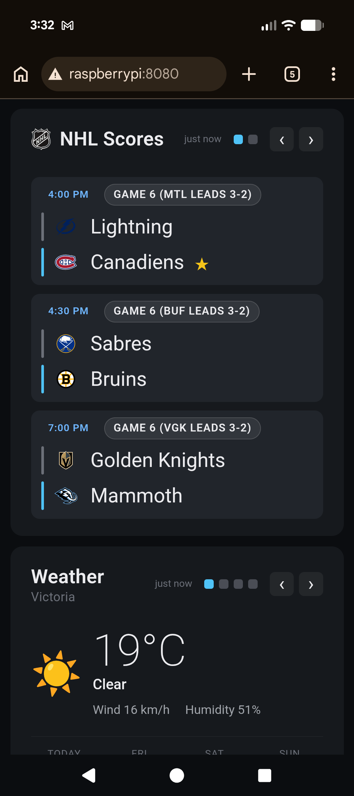

# Pi Dashboard

A zero-dependency dashboard for a Raspberry Pi + LCD, showing NHL scores, weather,
and rotating RSS feeds.

## Running

```shell
python3 server.py
```

Then open <http://localhost:8080>. Port can be overridden with `DASHBOARD_PORT=9000`.

Screenshot:



Picture of it displayed via my Pi on a [small 10" screen](https://www.amazon.ca/dp/B0CR43GHWT?ref_=ppx_hzsearch_conn_dt_b_fed_asin_title_3):


Screenshot of mobile view:



## Configuration

Edit [config.json](config.json):

- `weather.latitude` / `weather.longitude` — used by Open-Meteo.
- `weather.label` — display label (e.g. city name).
- `nhl.teams` — array of team abbreviations (e.g. `["OTT"]`). Empty array shows all games.
- `rss` — array of `{name, url}`. All entries rotate.
- `rotation.rssSeconds` — how often the RSS panel switches to the next feed.

## Endpoints

- `GET /` — dashboard.
- `GET /api/config` — client-relevant config (rotation settings).
- `GET /api/nhl[?date=YYYYMMDD]` — today's games (or games on a specific date).
- `GET /api/weather` — current + 3-day forecast.
- `GET /api/rss?feed=<N>` — top 5 items from the Nth configured feed.

## Kiosk mode on the Pi

Add to `~/.config/autostart/dashboard.desktop`:

```
[Desktop Entry]
Type=Application
Name=Dashboard
Exec=chromium-browser --kiosk --noerrdialogs --disable-infobars http://localhost:8080
```

And run `server.py` as a systemd user service so it starts on boot.

## Dependencies

None beyond the Python 3 standard library. Tested with Python 3.10+.
