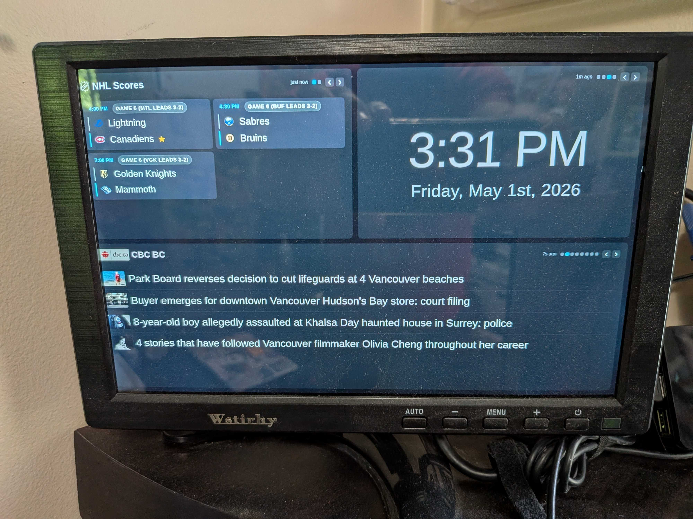

# Pi Dashboard

A zero-dependency dashboard for a Raspberry Pi + LCD, showing NHL scores, weather,
and rotating RSS feeds.

See [docs/Overview.md](docs/Overview.md) for the full feature list.

## Running

All Python source and the static frontend live under [`src/`](src/). Run the
server from the repo root:

```shell
python3 src/server.py
```

Then open <http://localhost:8080>. Port can be overridden with `DASHBOARD_PORT=9000`.

Screenshot:


Picture of it displayed via my Pi on a [small 10" screen](https://www.amazon.ca/dp/B0CR43GHWT?ref_=ppx_hzsearch_conn_dt_b_fed_asin_title_3):



Screenshot of mobile view:


## Configuration

Edit [src/config.json](src/config.json):

- `weather.latitude` / `weather.longitude` — used by Open-Meteo.
- `weather.label` — display label (e.g. city name).
- `nhl.favorites` — array of team abbreviations (e.g. `["OTT"]`). Favorited teams
  sort to the top of their status group and get a ★ next to the team name. Empty
  array shows all games with no preference.
- `rss` — array of `{name, url}`. All entries rotate.
- `rotation.rssSeconds` — how often the RSS panel switches to the next feed.

## Endpoints

- `GET /` — dashboard.
- `GET /api/config` — client-relevant config (rotation settings).
- `GET /api/nhl[?date=YYYY-MM-DD]` — today's games (or games on a specific date).
- `GET /api/weather` — current + 3-day forecast.
- `GET /api/rss?feed=<N>` — top 4 items from the Nth configured feed.

## Kiosk mode on the Pi

Add to `~/.config/autostart/dashboard.desktop`:

```
[Desktop Entry]
Type=Application
Name=Dashboard
Exec=chromium-browser --kiosk --noerrdialogs --disable-infobars http://localhost:8080
```

And run `src/server.py` as a systemd user service so it starts on boot. See
[docs/deployment.md](docs/deployment.md) for the full Pi setup.

## Tests

Pure-Python unit tests for the parsers, cache layer, and config merge. Stdlib
only — no pytest, no fixtures runner.

```shell
cd src && python3 -m unittest discover -v
```

Fixtures (small captured upstream payloads) live in `src/tests/fixtures/`.
There are no JS tests; the frontend is exercised manually via the browser per
CLAUDE.md.

## Dependencies

None beyond the Python 3 standard library. Tested with Python 3.10+.
